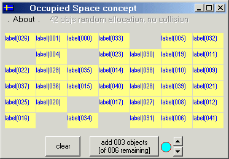



## Occupied Space concept used to allocate 100 labels randomly w/o overlapping \(no API\)

### Description

Populates form area with labels, using the 'unoccupied space' concept, instead of intersection.

Any added item, while populating the screen, takes a cell from the 'unoccupied space', resulting

in a much faster process than intersection. Nice to see.

----

idea proposed by Gunnar g68_se@yahoo.se, SECOND EMAIL:

Pietro, one more thing:

What i really, originally was thinking, was to be able

to

1. Press a button, and choose a number to allocate,

let's say 20 labels, then

2. Press the button again if one likes, and chose

another number to allocate, let's say 12.

..

..

3. Press (any) more times, until the MaxObjectIndex is

reached (or, when it's not possible to allocate more

without collision).

And then the question (from my earlier mail) would

come (yes/no/cancel).

The program would know from the first time, where to

find the "unoccupied space".

I guess this would take some kind of storing the

occupied spaces or something

if i should be able to use the code, it has to be done

with (invisible) objects placed at design-time (100),

not loaded :)

I wish you many votes at PSC, i know you got mine !

/Gunnar.

FIRST EMAIL WAS (which originated my post: How to allocate HUNDREDS rectangles (labels, images...) without overlapping, no API!):

Hello Pietro !

I was studying your excellent code-example of the

rectangle-Intersections.

I got inspired by it, and i have a problem in my

application, but i do not know how to code it, i was

thinking maybe you could help me.

* I have an array of labels

* I also have a function to place the labels out

randomly over the screen

Private sub Place_Labels

Dim lIndex As Long

Randomize timer

For lIndex = 0 To cmd.Count - 1

cmd(lIndex).Move (Rnd * (ScaleWidth -

cmd(lIndex).Width)), (Rnd * (ScaleHeight -

cmd(lIndex).Height))

Next

End sub

This procedure sometimes places the labels "on top of

eachother".

1) I would like to add some code to prevent

collisions, so that every labels is placed on a

separate position.

Maybe your code could help me here, but i do not

really know how to do this,

i think i'd have to go through all of my labels, and

check if there is already

a label placed there, but i have no idea of how to

code this.

Can you help me ?

thanks in advance !

Best regards from sweden,

Gunnar.

----

This program has been written down in Visual Basic 6.

I hope yow like the effort, have fun :)
 
### More Info
 

             |
---                |---
**Submitted On**   |2001-08-24 04:33:42
**By**             |[pietro ing\. cecchi](https://github.com/Planet-Source-Code/PSCIndex/blob/master/ByAuthor/pietro-ing-cecchi.md)
**Level**          |Advanced
**User Rating**    |5.0 (15 globes from 3 users)
**Compatibility**  |VB 6\.0
**Category**       |[Math/ Dates](https://github.com/Planet-Source-Code/PSCIndex/blob/master/ByCategory/math-dates__1-37.md)
**World**          |[Visual Basic](https://github.com/Planet-Source-Code/PSCIndex/blob/master/ByWorld/visual-basic.md)
**Archive File**   |[Occupied S252488232001\.zip](https://github.com/Planet-Source-Code/pietro-ing-cecchi-occupied-space-concept-used-to-allocate-100-labels-randomly-w-o-overlapp__1-26451/archive/master.zip)

